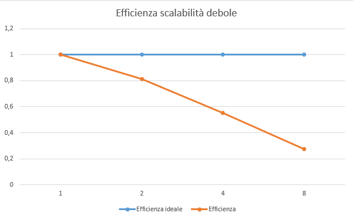
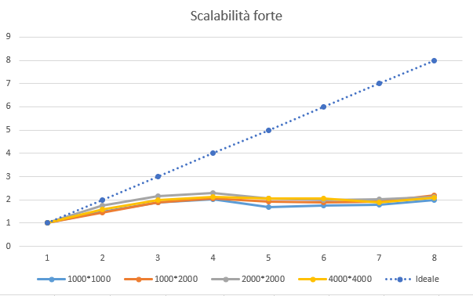
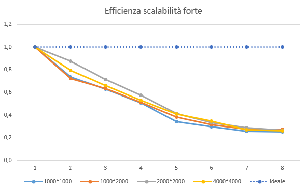

# Game of Life report

| Studente | Ripoli Federico |
|:---:|:---:|
| Matricola | 0522500921 |
| MD5 | 3f783db3da61a4bb1bfc4f680c415ad7|
| Progetto | *Game of Life* |
| Istanza EC2 | t2.Xlarge |

## Introduzione

In questo documento verrà descritta l'implementazione del progetto *Game of Life* realizzata da Ripoli Federico.  
In particolare, il progetto è stato realizzato nel linguaggio C facendo uso della libreria di messaggistica *mpi.h*, quindi operante anche su sistemi cluster.  
I punti focali che hanno portato alla realizzazione di questa implementazione sono stati: il trade-off nell'ottimizzazione tra il fattore tempo e il fattore spazio, le caratteristiche del C e l'uso del canale di comunicazione.  
Il trade-off scelto ha spinto verso un'ottimizzazione dello spazio; questa è stata ottenuta realizzando una sola matrice di lavoro per nodo a discapito di un tempo di esecuzione teoricamente doppio rispetto ad una variante ad ottimizzazione del tempo. Il tempo viene raddoppiato perché, non usando più solo due possibili stati (*alive* e *dead*) per la singola cella, ma quattro (***a**live*, ***d**ead*, ***b**orn* e ***e**mpty*), abbiamo bisogno di un secondo ciclo durante ogni generazione per riscrivere le celle modificate. Nel dettaglio, per non dover creare una nuova matrice, si è optato nell'utilizzo di due stati intermedi, come nel ciclo della vita: inizialmente ogni cella può essere ***a**live* o ***e**mpty* e nel corso della generazione può nascere (***b**orn*) o morire (***d**ead*); quindi abbiamo bisogno di questo nuovo ciclo per mutare i nascituri (***b***) in viventi (***a***) e i defunti (***d***) in celle vuote (***e***) prima del passaggio alla nuova generazione.  
Gli altri due punti, le caratteristiche del C e l'uso del canale di comunicazione, hanno portato alla scelta di dividere in base alle righe il lavoro da assegnare ai nodi; questo semplifica il lavoro di accesso alla memoria, poiché il C è un linguaggio *row-based*, e ci aiuta a non intasare il canale di comunicazione con un numero eccessivo di messaggi. Questi previsioni teoriche sono scaturite dallo studio delle altre modalità di divisione del lavoro:  

- divisione per colonne, che è più raccomandata per linguaggi come Fortran, essendo *column-based*;

- divisione in quadranti, cioè dividere sia in base alle righe che alle colonne, che avrebbe portato a un maggior numero di messaggi nel canale di comunicazione.

## Dettagli implementativi

Il programma proposto è stato pensato per lavorare con un gran numero di righe; se il numero risulta troppo basso da non garantire un minimo di computazione non condizionata dallo scambio di messaggi, il programma verrà eseguito su un singolo nodo. Il programma opera su *mondi* generati casualmente, ma per poterlo testare si è usato un *seed* fisso, impostato a 0.

Al fine di rendere il file sorgente più leggibile e comprensibile, sono state introdotte le seguenti funzioni:

- countAlive(), conta il numero di celle nello stato ***a*** nelle otto celle nell'intorno della cella selezionata, contando anche se quest'ultima è ***a***; non opera sulla porzione di matrice condivisa dai vicini;

```c
int countAlive(char* cell, int row, int col, int numR, int numC) {
  int alive = 0;
  for(int i = -1; i < 2; i++) {
    if ((row + i > -1) && (row + i < numR)) {
      for(int j = -1; j < 2; j++) {
        if ((col + j > -1) && (col + j < numC)) {
          if ((cell[(row + i) * numC + col + j] == 'a') ||
              (cell[(row + i) * numC + col + j] == 'd')) {
            alive++;
          }
        }
      }
    }
  }
  return alive;
}
```

- countBorderAlive(), completa la funzione countAlive() contando il numero delle celle nello stato ***a*** nell'array ricevuto dal vicino; le si può passare anche un array nullo;

```c
int countBorderAlive(int col, char* borderArray, int dim) {
  if (borderArray == NULL) return 0;
  int alive = 0;
  for(int i = col - 1; i < col + 2 ; i++) {
    if ((i > -1) && (i < dim)) {
      if (borderArray[i] == 'a') {
        alive++;
      }
    }
  }
  return alive;
}
```

- checkLiveness() e checkBirth(), che, rispettivamente, controllano se una cella resta nello stato ***a*** e se una cella nello ***e*** deve cambiare in ***b***; entrambe fanno uso delle funzioni precedenti;

```c
bool checkLiveness(char* cell, int row, int col, 
                   int  numR, int numC, char* borderArray) {
  int alive = countAlive(cell, row, col, numR, numC);
  int bAlive = countBorderAlive(col, borderArray, numC);
  alive += bAlive;
  if ((alive < 3) || (alive > 4)) {
    return false;
  }
  return true;
}

bool checkBirth(char* cell, int row, int col, 
                int numR, int numC, char* borderArray) {
  int alive = countAlive(cell, row, col, numR, numC);
  int bAlive = countBorderAlive(col, borderArray, numC);
  alive += bAlive;
  if (alive == 3) {
   return true;
 }
 return false;
}
```

- printWorld(), per stampare la matrice;

```c
void printWorld(char* world, int dimR, int dimC) {
  for (int i = 0; i < dimR; i++) {
    for (int j = 0; j < dimC; j++) {
      if (world[i * dimC + j] == 'a') {
        printf("O");
      }
      else {
        printf(" ");
      }  
    } 
    if (dimC > 1) printf("\n");
  }
}
```

- grow(), la funzione *in più* che viene eseguita prima di passare alla generazione successiva con il compito di *completare lo sviluppo* delle celle ***b*** e ***d***.

```c
void grow(char* world, int dimR, int dimC) {
  for (int i = 0; i < dimR; i++) {
    for (int j = 0; j < dimC; j++) {
      if (world[i * dimC + j] == 'b') {
        world[i * dimC + j] = 'a';
      }
      if (world[i * dimC + j] == 'd') {
        world[i * dimC + j] = 'e';
      }
    }
  }
}
```

La funzione checkLiveness() controlla che ci siano tre o quattro celle vive perché, contando anche se stessa, i valori sono stati incrementati di un'unità, essendo chiamata quando una cella è ***a***; modifica non apportata a checkBirth() perché la funzione viene chiamata solo nel caso di cella ***e***.

### Esecuzione

Per poter eseguire il programma bisogna prima compilarlo con il seguente comando:

```c
mpicc game_of_life.c -o game
```

Per comodità abbiamo dato il nome "*game*" al file eseguibile.  
Successiva eseguiamo il programma con il seguente comando:

```c
mpirun -np <numero nodi> game [c] <numero generazioni> <numero righe> [numero colonne]
```

Nello specifico, gli argomenti richiesti sono:

- \<numero nodi> : è il numero di nodi su cui far eseguire il programma;  
- [ c ] : opzionale, da inserire come primo argomento se si vuole eseguire il test di confronto con l'esecuzione sequenziale;
- \<numero generazioni> : il numero di generazioni da simulare;
- \<numero righe> : il numero di righe della matrice;
- [ numero colonne ] : opzionale, il numero di colonne della matrice, se non inserito verrà generata una matrice quadrata basandosi sul numero di righe.

## Performance

Le performance sono state ricavate dall'esecuzione del programma su un docker in esecuzione su un computer dual-core a quattro threads, a causa della chiusura prematura dell'account AWS Educate. Questo ha causato anche la generazione di tempi talvolta altalenanti a causa di altri programmi in esecuzione sul computer; i tempi peggiori sono stati scartati, tenendo conto per il testing solo delle tre esecuzioni migliori per ogni configurazione.  
Per il testing, si è deciso di eseguire il programma con lo sviluppo di 100 generazioni.  
Le misure di performance estratte e studiate sono state: **scalabilità debole** e **scalabilità forte**.

### Scalabilità debole

La scalabilità debole confronta il tempo che un processore impiega per eseguire un problema di taglia *n* con il tempo che *k* processori impiegano per eseguire un problema di taglia *n\*k*. La formula per il calcolo dello speed-up scalato derivante dall'applicazione di questa metrica è:

```c
speed-up scalato = (k * T(1, n)) / T(k, k * n)
```

In cui, T(x, y) è il tempo che *x* processori impiegano per eseguire un problema di taglia *y*.  
I risultati derivanti da questo calcolo sono riportati nella tabella di seguito.

#### Tabella Scalabilità debole

| Numero   nodi | Dimensione   problema | Tempo impiegato | Speed-up scalato | Efficienza |
|:---------------:|:-----------------------:|:-----------------:|:------------------:|:------------:|
| 1             | 1000*1000             | 9,190759        | 1                | 1          |
| 2             | 2000*1000             | 11,297744       | 1,63             | 0,81       |
| 4             | 4000*1000             | 16,685828       | 2,20             | 0,55       |
| 8             | 8000*1000             | 33,339775       | 2,21             | 0,28       |

I dati descritti in questa tabella possono essere riassunti ed esposti nel seguente grafico:

](./img/weak-scalability.png)

In cui notiamo che, rispetto a quello che sarebbe lo speed-up scalato ideale, il sistema guadagna velocità d'esecuzione fino all'utilizzo di quattro macchine, rimanendo costante nel caso proviamo a raddoppiare ulteriormente la dimensione *k* del problema e il numero di macchine.  

Inoltre, dalla [tabella precedente](#tabella-scalabilit%C3%A0-debole), possiamo anche estrarre il seguente grafo riguardante l'efficienza dei nodi nelle diverse esecuzioni, secondo la scalabilità debole:



Dal grafo notiamo un drastico calo dell'efficienza nel sistema all'aumentare della dimensionalità di *k*. La causa di questi valori è imputabile all'architettura del computer, essendo limitato da un processore dual-core con quattro threads.

### Scalabilità forte

La scalabilità forte, invece, confronta il tempo di esecuzione di un programma relativo ad un problema di dimensione *n* con *k* processori rispetto al tempo che impiegherebbe un solo processore ad eseguire lo stesso programma. La formula per calcolare lo speed-up derivante è:

```c
speed-up = T(k, n) / T(1, n)
```

In cui, T(x, y) è il tempo che *x* processori impiegano per eseguire un problema di taglia *y*.  
I tempi (in minuti) di esecuzione, per diverse grandezze di istanza, sono descritti nella tabella di seguito.

| Numero   di nodi | 1000\*1000 | 1000\*2000 | 2000\*2000 | 4000\*4000  |
|----------------|-----------|-----------|-----------|------------|
| 1                | 9,190759  | 18,083836 | 38,127372 | 142,606228 |
| 2                | 6,241977  | 12,511344 | 21,743044 | 89,480694  |
| 3                | 4,874591  | 9,504424  | 17,795393 | 71,818762  |
| 4                | 4,517504  | 8,798993  | 16,527590 | 67,078137  |
| 5                | 5,406323  | 9,431421  | 18,530314 | 69,369993  |
| 6                | 5,200976  | 9,543708  | 19,142213 | 68,825477  |
| 7                | 5,104083  | 9,416476  | 18,821977 | 75,527298  |
| 8                | 4,587389  | 8,279229  | 17,885756 | 68,197637  |

Dai tempi illustrati nella precedente tabella ricaviamo gli speed-up descritti nella seguente tabella.

| Numero di nodi | 1000\*1000 | 1000\*2000 | 2000\*2000 | 4000\*4000 | media |
|:--------------:|:---------:|:---------:|:---------:|:---------:|:-----:|
|        1       |    1,00   |    1,00   |    1,00   |    1,00   |  1,00 |
|        2       |    1,47   |    1,45   |    1,75   |    1,59   |  1,57 |
|        3       |    1,89   |    1,90   |    2,14   |    1,99   |  1,98 |
|        4       |    2,03   |    2,06   |    2,31   |    2,13   |  2,13 |
|        5       |    1,70   |    1,92   |    2,06   |    2,06   |  1,93 |
|        6       |    1,77   |    1,89   |    1,99   |    2,07   |  1,93 |
|        7       |    1,80   |    1,92   |    2,03   |    1,89   |  1,91 |
|        8       |    2,00   |    2,18   |    2,13   |    2,09   |  2,10 |

Da questi valori possiamo notare che, indipendentemente dalla taglia del problema, lo speed-up cresce finché non si raggiunge il limite massimo di threads logici del computer, cioè 4, per poi stazionare in valori lievemente inferiori nel caso in cui si provi ad aggiungere ulteriori nodi.  



Dal grafico illustrato si evidenzia più nitidamente che, per tutte le dimensioni del problema, non si riesce ad avere uno speed-up superiore a *2*, ben lontano dallo speed-up ideale.  

Valutiamo, ora l'efficienza dei nodi nel nostro sistema rispetto alla scalabilità forte.

| Numero   di nodi | 1000\*1000 | 1000\*2000 | 2000\*2000 | 4000\*4000 | media |
|:----------------:|:---------:|:---------:|:---------:|:---------:|:-----:|
|         1        |   1,000   |   1,000   |   1,000   |   1,000   | 1,000 |
|         2        |   0,736   |   0,723   |   0,877   |   0,797   | 0,783 |
|         3        |   0,628   |   0,634   |   0,714   |   0,662   | 0,660 |
|         4        |   0,509   |   0,514   |   0,577   |   0,531   | 0,533 |
|         5        |   0,340   |   0,383   |   0,412   |   0,411   | 0,387 |
|         6        |   0,295   |   0,316   |   0,332   |   0,345   | 0,322 |
|         7        |   0,257   |   0,274   |   0,289   |   0,270   | 0,273 |
|         8        |   0,250   |   0,273   |   0,266   |   0,261   | 0,263 |

Dalla tabella si nota che, efficienza si riduce drasticamente all'aumentare del numero di nodi, effetto ancora più evidente se visto graficamente, come sotto riportato.



## Conclusioni

Possiamo riassumere che i risultati dei test sono stati molto peggiori di quello che ci si aspettava a causa della mancata possibilità di averli effettuati su un cluster reale, ma aver simulato quest'ultimo su una macchina non molto performante.  

Possiamo dedurre dai risultati che, sia nel caso della scalabilità forte che in quella debole, lo speed-up si stabilizza intorno al valore **2** quando viene eseguito con quattro o più macchine.
